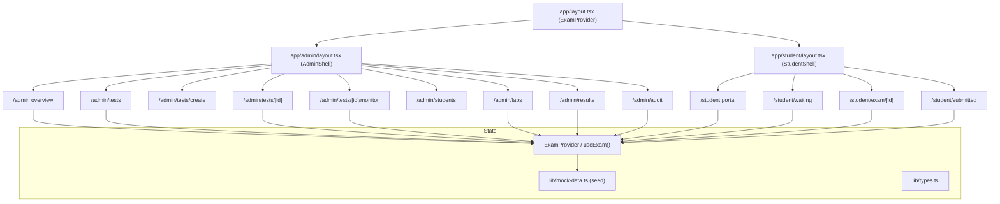
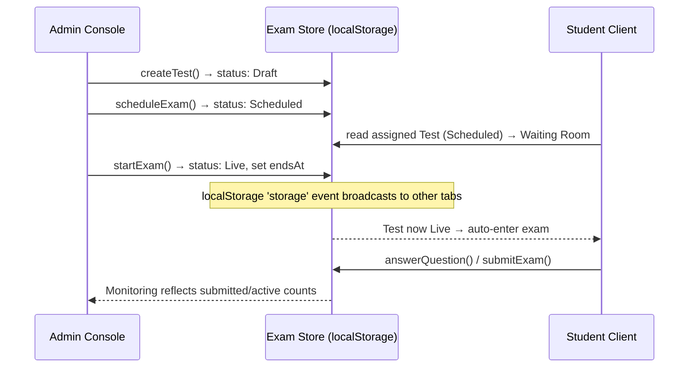

# Design Document

## Overview

The College Exam Control Platform is a frontend-only Next.js (App Router) application written in TypeScript and styled with Tailwind CSS v4 plus a project stylesheet (`app/globals.css`). It simulates the full examination lifecycle across two experiences — an Admin Console under `/admin` and a Student Client under `/student` — sharing a single client-side state layer, the Exam Store.

The project already contains a working foundation: an `ExamProvider` React context (the Exam Store) backed by `localStorage`, a typed model layer (`lib/types.ts`), seed data (`lib/mock-data.ts`), formatting helpers (`lib/format.ts`), reusable UI primitives (`components/ui.tsx`), layout shells (`components/shells.tsx`), an SVG icon set (`components/icons.tsx`), and initial admin/exam/student screens. This design extends that foundation rather than replacing it.

The primary gaps between the current implementation and the requirements are:

- **Per-computer / per-student presence.** Today the store models a single hardcoded student and MCQ-only questions. The requirements need many students bound to lab computers, each with a Connection Status, Student Exam Status, warning count, heartbeat, and activity timeline.
- **Missing/partial routes.** `/admin/tests/[id]/monitor`, `/admin/labs`, `/admin/audit`, `/admin/tests/create`, and detail pages need full implementations against the richer model.
- **Question variety.** Requirements call for MCQ (single), Multiple Choice (multi-select), and Text Answer types.

The design adds a **presence model** (computers + per-student session state) to the store, extends types, enriches seed data, and builds the reusable components and pages that consume them.

### Design Principles

- **Backend-replaceable seams.** Components never import seed data directly; they read from `useExam()` selectors. The store's shape mirrors what a REST/WebSocket backend would return, so the seed source can be swapped for network calls without touching components.
- **Shared session time.** The Exam Timer derives remaining time from a Test's `endsAt` timestamp (already present), never from a local countdown origin, so it is trivially replaced by server time later.
- **Composition over duplication.** Pages are thin; they compose reusable admin/exam/ui components.
- **Restrained visual system.** A single CSS variable palette in `globals.css` drives typography, spacing, borders, and the Online/Warning/Offline status colors.

## Architecture

### High-level structure



### Data flow and lifecycle simulation



Cross-tab synchronization already works via the `storage` event listener in `ExamProvider`, letting a reviewer open the Admin Console in one tab and the Student Client in another and watch state propagate.

### Presence simulation

Because there is no backend emitting heartbeats, live monitoring data (Connection Status, activity, heartbeat age) is generated deterministically from seed records plus a lightweight client tick. Each computer/session has seeded baseline values (e.g., `connection: "online" | "warning" | "offline"`, `warnings`, `loginAt`, `lastHeartbeatAt`, `activity[]`). The Monitoring Dashboard displays these directly; a `setInterval` tick recomputes derived "time since last heartbeat" strings for realism. No randomization is used for correctness-critical values, keeping the UI stable and reviewable.

## Components and Interfaces

### Directory layout (target)

The current project keeps components grouped by domain in a few files (`admin-screens.tsx`, `student-screens.tsx`, `exam.tsx`, `ui.tsx`, `shells.tsx`). The design keeps this pragmatic grouping and adds monitoring/labs building blocks. Requirement 19's named building blocks are satisfied as exported functions, whether colocated or split into files under `components/admin/` and `components/exam/`.

```
frontend/
  app/
    layout.tsx                      # ExamProvider (exists)
    providers.tsx                   # Exam Store (extend)
    admin/
      layout.tsx, page.tsx          # AdminShell + overview
      tests/page.tsx, create/page.tsx
      tests/[id]/page.tsx, [id]/monitor/page.tsx
      students/page.tsx, labs/page.tsx, results/page.tsx, audit/page.tsx
    student/
      layout.tsx, page.tsx, waiting/page.tsx
      exam/[id]/page.tsx, submitted/page.tsx
  components/
    shells.tsx                      # AdminShell, StudentShell (exists)
    ui.tsx                          # Button, Badge, Card, Modal, Table, etc. (exists)
    icons.tsx                       # Icon set (extend as needed)
    admin-screens.tsx               # dashboard, tests, details, students, results, audit
    monitor.tsx                     # StudentMonitor, MonitorStats, StudentDetailPanel, ActivityTimeline (new)
    labs.tsx                        # LabCard, ComputerGrid (new)
    exam.tsx                        # ExamTimer, QuestionPalette, QuestionCard, SubmitDialog (extend for question types)
    student-screens.tsx             # portal, waiting room, exam screen, submitted
  lib/
    types.ts                        # extend with Computer, session, question types
    mock-data.ts                    # extend seed: many students, computers, sessions
    format.ts                       # helpers (exists)
    selectors.ts                    # derived read helpers (new, optional)
```

### Reusable component inventory (Requirement 19)

Admin building blocks: `AdminShell` (sidebar + header, exists), `StatCard` (exists), `TestTable`, `StudentTable`, `LabCard`, `ComputerGrid`, `StudentMonitor`, `ActivityTimeline`, `StudentDetailPanel`.

Exam building blocks: `ExamHeader` (from StudentShell exam mode), `QuestionPalette` (navigation, exists), `QuestionCard` (extend), `ExamTimer` (exists), `SubmitDialog` (exists), `WaitingRoomScreen` (exists), `SystemCheck`.

Shared UI: `Badge`, `Button`/`ButtonLink`, `Card`, `Modal`, `TableShell`, `EmptyState`, `LoadingState`, `ToastViewport`, `StatusDot` (new), `Progress`, `Field`/`Select`.

### Key component interfaces

```typescript
// Status indicator shared across admin views
function StatusDot(props: { status: ConnectionStatus | "ready" | "occupied" | "maintenance" }): JSX.Element;

// Live monitoring table
function StudentMonitor(props: {
  sessions: MonitorRow[];              // joined computer + student + session
  filter: MonitorFilter;              // "all" | "active" | "warning" | "offline" | "submitted"
  onSelect: (studentId: string) => void;
}): JSX.Element;

// Side panel opened from the monitor
function StudentDetailPanel(props: {
  row: MonitorRow | null;
  onClose: () => void;
}): JSX.Element;

function ActivityTimeline(props: { events: ActivityEntry[] }): JSX.Element;

// Labs
function LabCard(props: { lab: Lab; online: number; total: number; onOpen: () => void }): JSX.Element;
function ComputerGrid(props: { computers: ComputerView[] }): JSX.Element;

// Question rendering supporting all types
function QuestionCard(props: {
  question: Question;
  answer: AnswerValue | undefined;
  onAnswer: (value: AnswerValue) => void;
  // ...navigation + flag props
}): JSX.Element;
```

## Data Models

The existing `lib/types.ts` is extended. Existing fields are preserved for backward compatibility; new fields and types are additive.

### Enumerations

```typescript
export type ExamStatus = "draft" | "scheduled" | "live" | "completed";

// Per-student exam progress (aligns with requirement labels Not Ready / Ready / Taking Test / Submitted)
export type StudentExamStatus =
  | "not-ready"     // Not Ready
  | "ready"         // Ready (checked in / connected)
  | "in-progress"   // Taking Test
  | "submitted";    // Submitted

export type ConnectionStatus = "online" | "warning" | "offline";

export type QuestionType = "mcq" | "multiple" | "text";

export type AuditSeverity = "info" | "warning" | "critical";
```

### Question and answers (extended for multiple types)

```typescript
export interface Question {
  id: string;
  type: QuestionType;
  prompt: string;
  options: string[];        // empty for "text"
  correctOption?: number;   // for "mcq"
  correctOptions?: number[];// for "multiple"
  marks: number;
}

// Normalized answer value stored per question
export type AnswerValue =
  | { kind: "single"; option: number }
  | { kind: "multiple"; options: number[] }
  | { kind: "text"; text: string };
```

### Computer and exam session (new)

```typescript
export interface Computer {
  id: string;            // e.g. "LAB2-PC-01"
  labId: string;
  index: number;         // PC number within the lab
  assignedStudentId?: string;
  connection: ConnectionStatus;
}

export interface ActivityEntry {
  at: string;            // ISO timestamp
  label: string;         // "Exam started", "Focus lost", ...
  severity: AuditSeverity;
}

// Per-student, per-test live session used by monitoring + labs + details
export interface ExamSession {
  testId: string;
  studentId: string;
  computerId: string;
  connection: ConnectionStatus;
  examStatus: StudentExamStatus;
  loginAt?: string;
  examStartedAt?: string;
  lastHeartbeatAt?: string;
  warnings: number;
  activity: ActivityEntry[];
}
```

### Test (extended)

```typescript
export interface Test {
  id: string;
  title: string;
  code: string;
  course: string;             // subject
  department: string;
  description?: string;
  durationMinutes: number;
  totalMarks: number;
  scheduledAt: string;
  status: ExamStatus;
  labId: string;
  assignedStudentIds: string[];   // roster
  instructions: string[];
  questions: Question[];
  config: ExamConfig;
  endsAt?: string;                // shared session end (set on start)
}

export interface ExamConfig {
  questionsPerStudent: number;
  randomizeQuestions: boolean;
  randomizeOptions: boolean;
  allowNavigation: boolean;
  autoSubmitOnExpiry: boolean;
}
```

### Store state (extended)

```typescript
export interface ExamState {
  version: 2;                 // bump to invalidate old localStorage
  tests: Test[];
  students: Student[];
  labs: Lab[];
  computers: Computer[];
  sessions: ExamSession[];    // presence + activity per student per test
  results: Result[];
  audits: AuditEvent[];       // extended with studentId, computerId, severity
  submissions: Submission[];
  answers: Record<string, Record<string, AnswerValue>>;
  flags: Record<string, string[]>;
  toasts: Toast[];
  mockResultMode: boolean;    // controls score visibility on submitted page (Req 15.3)
}
```

`AuditEvent` gains optional `studentId?`, `computerId?`, and its `severity` widens to `AuditSeverity` with a `category` field (`"connection" | "exam" | "system"`) to support the audit filters.

### Version migration

`ExamProvider` currently validates `version === 1`. The design bumps the seed to `version: 2`; `safeState` accepts only the current version and otherwise falls back to fresh seed, avoiding stale-shape crashes. `resetDemo` remains the escape hatch.

## Error Handling

- **Unknown route params.** Test detail, monitor, and exam pages resolve the Test by id; if absent, they render an `EmptyState`/not-found state with a link back (Req 5.5, 13.9).
- **Wrong lifecycle state.** The exam screen guards on `status === "live"`; scheduled/completed states render a closed-entry `EmptyState` and block answering (Req 13.9). The waiting room shows scheduled vs. released states (Req 12.3–12.4).
- **Form validation.** Create Test validates required Basic Information and Schedule fields before creation; invalid submits show inline field errors via the existing `Field error` prop and prevent navigation (Req 4.10).
- **Empty collections.** Tests list, students list, results, and audit render `EmptyState` when filters yield nothing (Req 3.6, 8.5, 10.5, 11.5).
- **Idempotent submission.** `submitExam` no-ops if a submission already exists, preventing double scoring (already implemented; preserved).
- **Hydration safety.** Screens gate on `hydrated` and render `LoadingState` until localStorage is read, avoiding SSR/client mismatch. All store-consuming components are `"use client"`.
- **Storage corruption.** `safeState` try/catches JSON parse and version checks; on failure it uses fresh seed rather than throwing.

## Testing Strategy

Testing is implementation-first and focused on core logic that is easy to break and hard to verify by eye. No test framework is currently installed; if unit tests are pursued, Vitest (aligns with the Vite/TS ecosystem) would be added and justified before install. Because tests are optional in the task plan, the default verification path is:

- **Type + build verification.** Run the Next.js build and `getDiagnostics` after each major section to confirm no type errors and no broken routes (Req 1.6). This is the primary gate.
- **Manual workflow walkthrough (developer-run, not automated).** Admin: Dashboard → Tests → Details → Start → Monitor. Student: Waiting → Exam → Submit → Submitted, verifying state propagation across tabs.

Optional automated unit tests (marked optional in tasks) would target pure logic where correctness is non-obvious:

- **Exam Timer math** — remaining time from `endsAt`, warning threshold crossing at 10 minutes, single expiry invocation (Req 18).
- **Scoring** — MCQ single, multi-select exact-match, and text (ungraded) handling in `submitExam` (Req 13.4, 14.2).
- **Filter/selector logic** — monitor filters and audit category filters return correct subsets (Req 6.5, 11.4).

Tests would avoid mocks/fake data that mask real behavior, exercising the actual store reducers and selector functions.

## Design Decisions and Rationale

- **Extend the existing store instead of adding Zustand.** The current context+localStorage store already satisfies Req 17 (shared state, persistence, cross-tab sync) with zero new dependencies. Adding Zustand would be churn without benefit, so no new state library is introduced.
- **Presence as seeded sessions, not random simulation.** Deterministic seed data keeps the monitoring and labs views stable and reviewable, while a display-only tick provides "live" feel. This mirrors a future WebSocket feed shape (`ExamSession` per student) so the swap is mechanical.
- **`endsAt`-driven timer.** Keeping the single shared end time (already used) directly satisfies Req 18.1's server-replaceable requirement.
- **Version bump for the store.** Extending the state shape risks crashing on old persisted data; bumping to `version: 2` and rejecting mismatches is the safest migration for a demo.
- **Normalized `AnswerValue` union.** A discriminated union cleanly supports all three question types and keeps scoring logic explicit, rather than overloading a single numeric answer field.
- **Grouped component files.** Following the project's existing convention (domain-grouped files) reduces friction and keeps diffs small, while still exposing every Req 19 building block as a named, reusable export.
